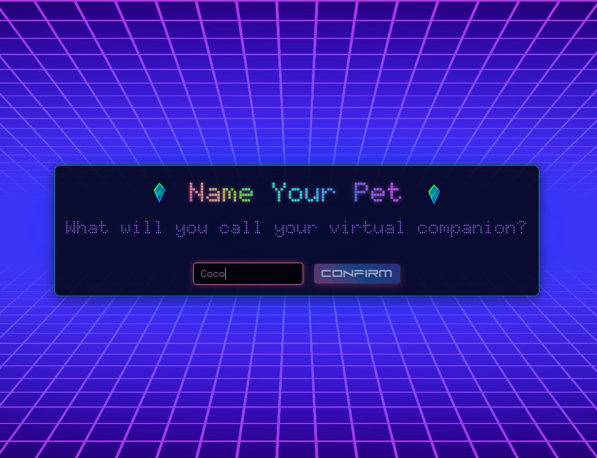
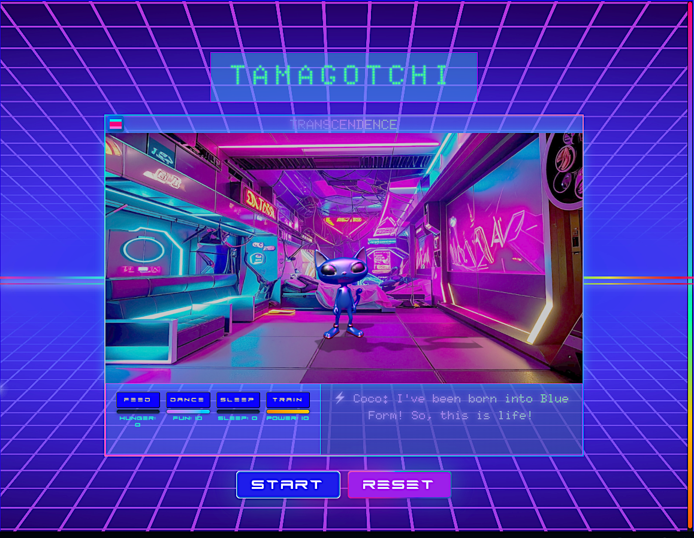
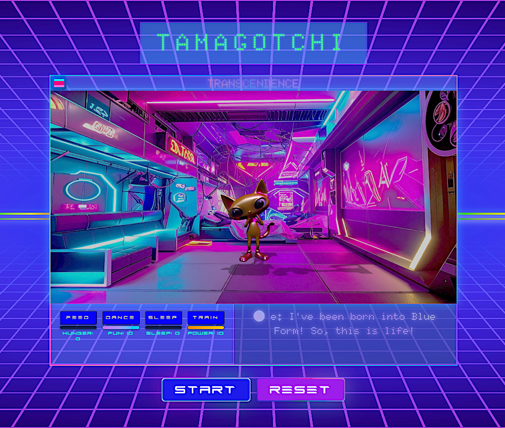
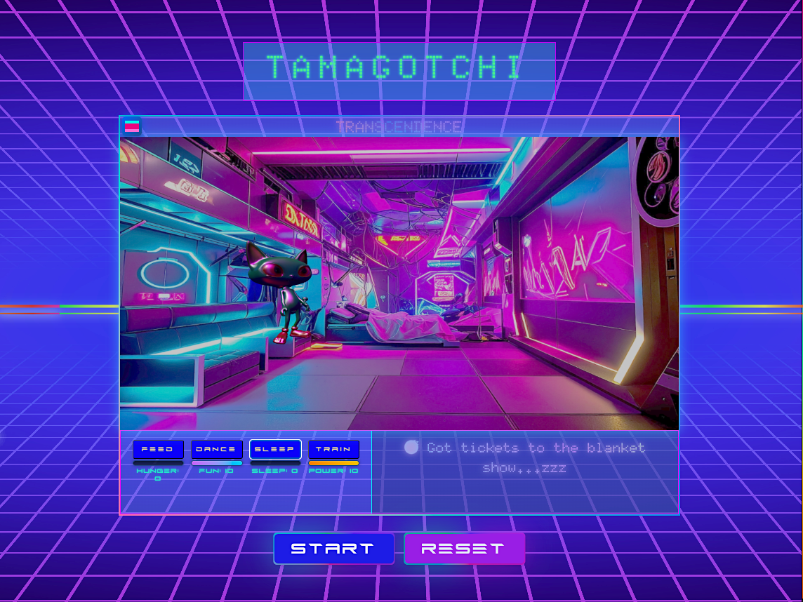
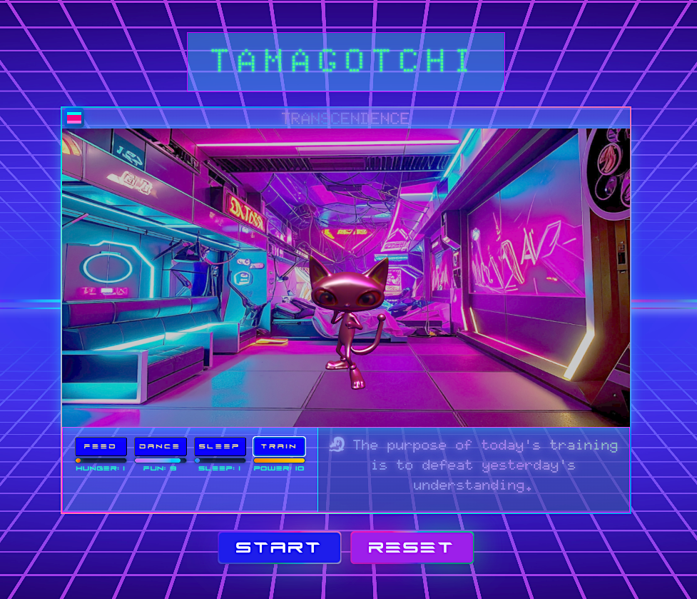
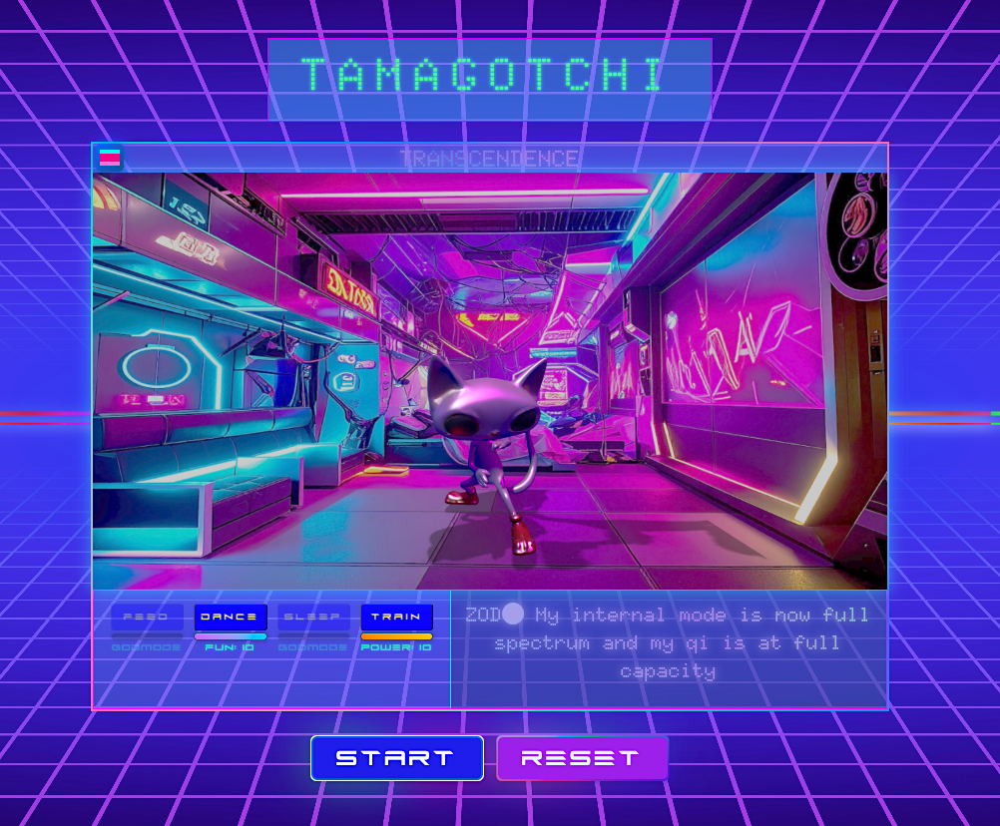
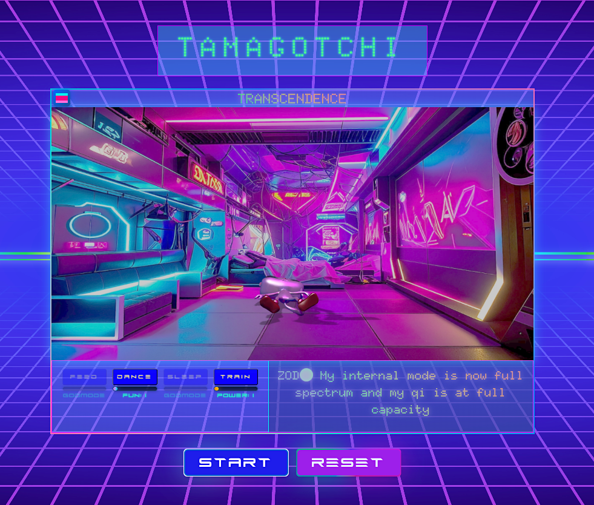
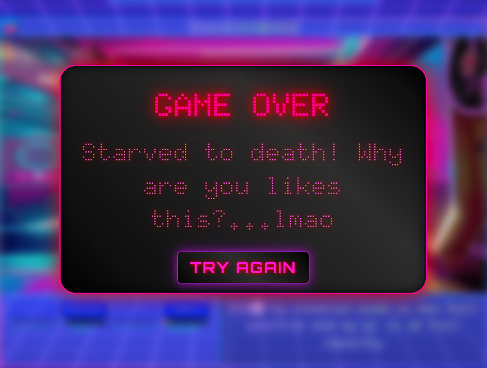
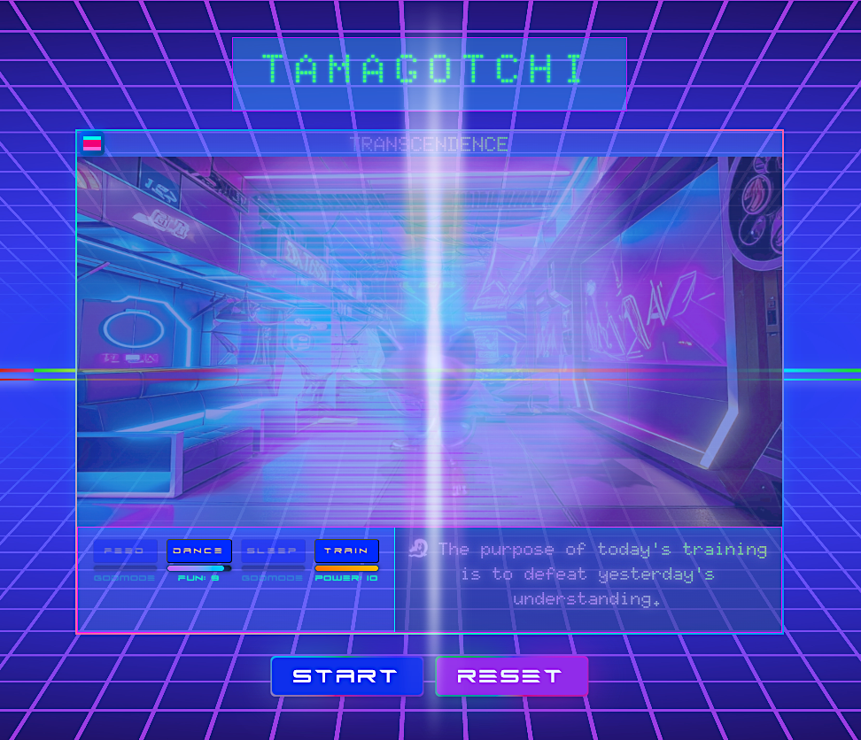
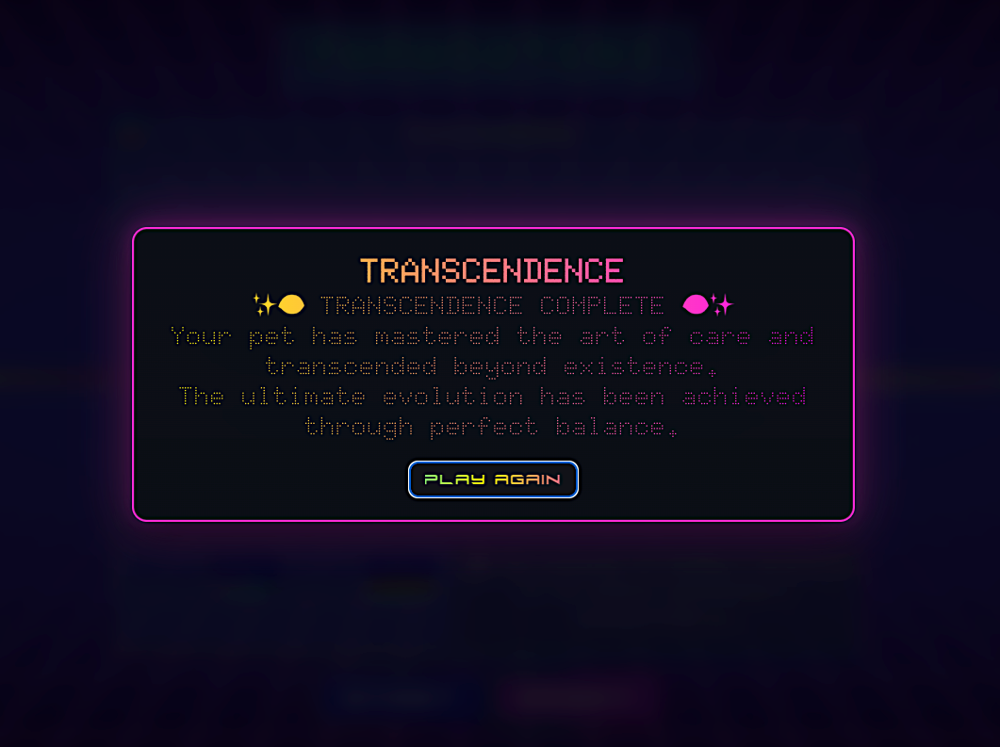

# Tamagotchi Transcendence — v2

A Tamagotchi-inspired evolution sim where your digital pet moves through the spectrum of light and emotion… and ultimately transcends.

**This is a major upgrade of my earlier project _transcendence-pet-sim_.** New UI, my own character designs, a device-style **power button**, a real **training** system, incremental **size growth** as the pet evolves, a **DNA sinewave** backdrop, a full **Blender → FBX → Three.js** animation pipeline, and a full **audio** pass (SFX + theme music switch).

## ✨ What's New

- **Power button** (boot/shutdown the sim).
- **Training** added as a core care action; required for evolution and for sustaining the final stage.
- **Incremental growth**: the creature scales up a bit each evolution (not just a color swap).
- **DNA sinewave** animated background.
- **3D pipeline**: modeled/rigged/animated in **Blender**, imported via **Three.js** FBX loader. **32 animations** total (idles, feed, dance, sleep, train, reacts, fail/success, etc.).
- **Audio polish**: training grunts & impacts; **music switches** during Dance.
- **Final stage rule**: in Translucent White, **Training is the only required care**; idle uses a **Qi-Gong/meditative** loop.
- **UI overhaul** for clarity and device feel.

## 🎮 Game Summary

You hatch a glitched egg. An intergalactic pet emerges and evolves by **color**, **mood**, and **size**. Keep it alive by **Feeding**, **Dancing**, **Sleeping**, and **Training**. Neglect it and it fades from the simulation; guide it well and it reaches a translucent, nearly-not-there state (transcendence).

## 🕹️ Controls & Care Actions

- **Power** — boot/shutdown.
- **Feed** — restore hunger.
- **Dance** — raise fun; switches to dance theme.
- **Sleep** — restore rest.
- **Train** — build discipline/power; SFX + grunts. _Required for evolution and for the White stage._

## 🌈 Evolution Order (current path)

1. 🐣 **Hatch / Blue** — first form
2. 🟡 **Yellow** — power / confidence
3. 🟢 **Green** — growth / energy
4. 🔴 **Red** — peak / fury
5. ⚪ **Translucent White** — transcendence (training-only care; qi-gong idle)

Each step tints the pet **and** scales it up slightly.

## 📈 Win / Lose

- **Win**: Reach **Translucent White** and maintain equilibrium (training only).
- **Lose**: Any stat bottoms out → pet fades from reality.

## 🔁 Core Loop (pseudocode)

POWER ON → boot sequence → glitch egg → hatch

while (powered && alive):
show stats (hunger, rest, fun, discipline)
wait for action:
Feed → hunger++
Dance → fun++ (switch to dance theme)
Sleep → rest++
Train → discipline++ (SFX/grunts)
if cycle complete (Feed + Dance + Sleep + Train) and thresholds met:
evolve() // color shift + size up + animation set
if stage === TranslucentWhite:
requiredCare = Train only (idle = qi-gong)
degrade stats over time
if any stat <= 0: fadeOut(); alive = false

POWER OFF → save state → shutdown animation

## 🧩 Tech & Pipeline

- **Three.js** scene + FBX animation blending
- **Blender** authoring (**32** animations)
- **Web Audio** for SFX and music switching
- Vanilla JS UI, device frame, **DNA sinewave** background

## 📷 Screenshots

### Power On / Intro Screen

### Glitch Egg / Hatch Sequence

### Blue Form (First Evolution)

### Yellow Form

### Green Form

### Red Form

### Translucent White (Transcendence)

### Gameplay Interface

### Additional Screenshots

## 🙌 Credits

- **Design / Code / Characters**: me
- Inspired by Tamagotchi + spectrum-of-light/energy ideas

## 🔭 Next Ideas

- Alternate evolution branch (Pink/Purple variants)
- Device "battery" meta stat tied to Power
- Soft achievements (e.g., Perfect Discipline chain)
- Easter egg: alternate game after user wins the game
